<div align="center">

# 🛡️ Cloud OT Honeypot with SIEM Integration

[](https://cloud.google.com)
[](https://github.com/telekom-security/tpotce)
[](https://splunk.com)
[](https://suricata.io)
[](https://github.com/ronankongala/ot-honeypot-gcp)

```
 ██████╗ ████████╗    ██╗  ██╗ ██████╗ ███╗   ██╗███████╗██╗   ██╗██████╗  ██████╗ ████████╗
██╔═══██╗╚══██╔══╝    ██║  ██║██╔═══██╗████╗  ██║██╔════╝╚██╗ ██╔╝██╔══██╗██╔═══██╗╚══██╔══╝
██║   ██║   ██║       ███████║██║   ██║██╔██╗ ██║█████╗   ╚████╔╝ ██████╔╝██║   ██║   ██║   
██║   ██║   ██║       ██╔══██║██║   ██║██║╚██╗██║██╔══╝    ╚██╔╝  ██╔═══╝ ██║   ██║   ██║   
╚██████╔╝   ██║       ██║  ██║╚██████╔╝██║ ╚████║███████╗   ██║   ██║     ╚██████╔╝   ██║   
 ╚═════╝    ╚═╝       ╚═╝  ╚═╝ ╚═════╝ ╚═╝  ╚═══╝╚══════╝   ╚═╝   ╚═╝      ╚═════╝    ╚═╝  
```

**Internet-facing OT honeypot capturing real attacker traffic — 66,000+ events in first hour**

[🗺️ Architecture](#architecture) • [🚀 Deployment](#deployment) • [📊 Findings](#threat-intelligence-findings) • [📸 Screenshots](#screenshots)

</div>

---

## ⚡ Live Stats (First Hour)

<div align="center">

| 🎯 Events Captured | 🌍 Countries | 🔥 Top Port | ⚠️ Suricata Alerts |
|:---:|:---:|:---:|:---:|
| **66,185+** | **Pakistan, Vietnam** | **Port 23 (Telnet)** | **15,315 AF-PACKET** |

</div>

---

## 🏗️ Architecture

```
┌─────────────────────────────────────────────────────────────┐
│                    INTERNET (Attacker Traffic)               │
│            🇵🇰 Pakistan  🇻🇳 Vietnam  🌐 Global Scanners      │
└─────────────────────────┬───────────────────────────────────┘
                          │
                          ▼
┌─────────────────────────────────────────────────────────────┐
│                  GCP VPC (ot-honeypot-vpc)                  │
│                                                             │
│  ┌─ Firewall Rules ────────────────────────────────────┐   │
│  │  ✅ ALLOW  TCP 502   (Modbus)                        │   │
│  │  ✅ ALLOW  TCP 20000 (DNP3)                          │   │
│  │  ✅ ALLOW  TCP 80    (HTTP honeypot)                 │   │
│  │  ✅ ALLOW  TCP 23    (Telnet/Cowrie)                 │   │
│  │  🔒 DENY   All egress                               │   │
│  └─────────────────────────────────────────────────────┘   │
│                                                             │
│  ┌─ honeypot-subnet 10.0.1.0/24 ──────────────────────┐   │
│  │                                                     │   │
│  │  ┌─ tpot-vm (Ubuntu 22.04 / e2-standard-2) ──────┐ │   │
│  │  │                                                │ │   │
│  │  │  🐋 Docker Containers (T-Pot 24.04)            │ │   │
│  │  │  ├── 🏭 Conpot  → Modbus / DNP3 / IEC104      │ │   │
│  │  │  ├── 🐚 Cowrie  → SSH / Telnet                 │ │   │
│  │  │  ├── 🔍 Suricata → IDS / Network Analysis      │ │   │
│  │  │  ├── 📊 ELK Stack → Kibana Dashboard           │ │   │
│  │  │  └── 📡 Splunk UF → Splunk Cloud SIEM          │ │   │
│  │  └────────────────────────────────────────────────┘ │   │
│  └─────────────────────────────────────────────────────┘   │
└─────────────────────────────────────────────────────────────┘
                          │
              ┌───────────┴───────────┐
              ▼                       ▼
    ┌─────────────────┐    ┌──────────────────┐
    │  Kibana / ELK   │    │   Splunk Cloud   │
    │  (built-in)     │    │  66,185+ events  │
    └─────────────────┘    └──────────────────┘
```

---

## 🛠️ Technologies Used

| Category | Tools |
|---|---|
| ☁️ Cloud Infrastructure | GCP VPC, Compute Engine, Cloud NAT, Firewall Rules |
| 🍯 Honeypot Frameworks | T-Pot 24.04, Conpot, Cowrie, Medpot, CiscoASA emulator |
| 🏭 OT Protocols Emulated | Modbus/502, DNP3/20000, IEC104, IPMI, Kamstrup 382 |
| 🔍 IDS | Suricata with Emerging Threats ruleset |
| 📊 SIEM | Splunk Cloud (Universal Forwarder), Kibana/ELK |
| 📋 Log Sources | Suricata eve.json, Conpot logs, SSH/Telnet honeypot logs |
| 🔎 Vulnerability Scanning | Nmap 7.80 (service version detection) |
| 🐋 Containerization | Docker Compose (20+ containers) |

---

## 🚀 Deployment

### Phase 1 — GCP Network Setup

```bash
# VPC and subnets
gcloud compute networks create ot-honeypot-vpc --subnet-mode=custom
gcloud compute networks subnets create honeypot-subnet \
  --network=ot-honeypot-vpc --region=us-central1 --range=10.0.1.0/24

# Firewall rules
gcloud compute firewall-rules create allow-honeypot-ports \
  --network=ot-honeypot-vpc --allow=tcp:502,tcp:20000,tcp:80,tcp:23 \
  --source-ranges=0.0.0.0/0
```

### Phase 2 — T-Pot Installation

```bash
git clone https://github.com/telekom-security/tpotce
cd tpotce
./install.sh -t i -u tpotadmin -p <password>
sudo reboot
```

### Phase 3 — Splunk SIEM Integration

```bash
# Install Universal Forwarder
wget -O splunkforwarder.deb "https://download.splunk.com/products/universalforwarder/releases/9.2.1/linux/splunkforwarder-9.2.1-78803f08aabb-linux-2.6-amd64.deb"
sudo dpkg -i splunkforwarder.deb

# Install Splunk Cloud credentials package
sudo /opt/splunkforwarder/bin/splunk install app splunkclouduf.spl

# Monitor T-Pot log sources
sudo /opt/splunkforwarder/bin/splunk add monitor /home/user/tpotce/data/suricata/log -sourcetype suricata
sudo /opt/splunkforwarder/bin/splunk add monitor /home/user/tpotce/data/conpot/log -sourcetype conpot
sudo /opt/splunkforwarder/bin/splunk add monitor /home/user/tpotce/data/honeypots/log -sourcetype honeypots
```

### Phase 4 — Vulnerability Scan

```bash
nmap -sV -p 22,80,502,20000,23 <honeypot-external-ip>
```

---

## 📸 Screenshots

### GCP VM Running
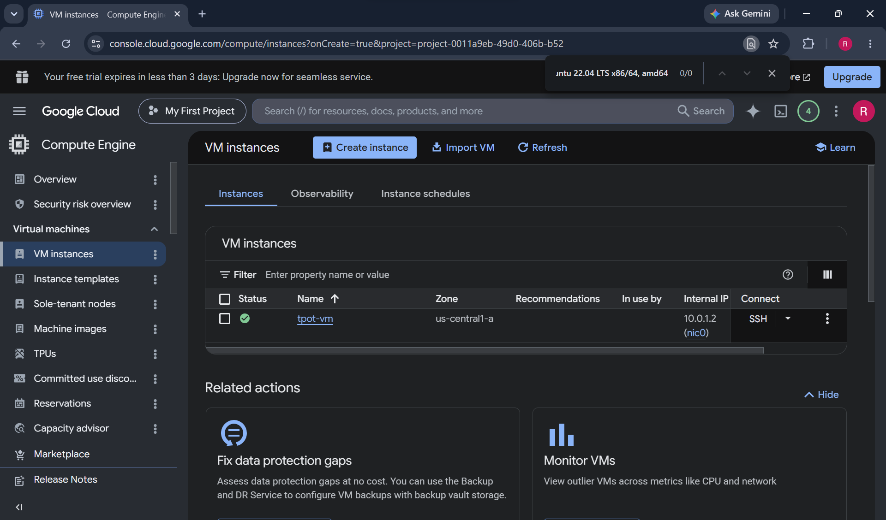

### T-Pot Docker Containers (20+ services)
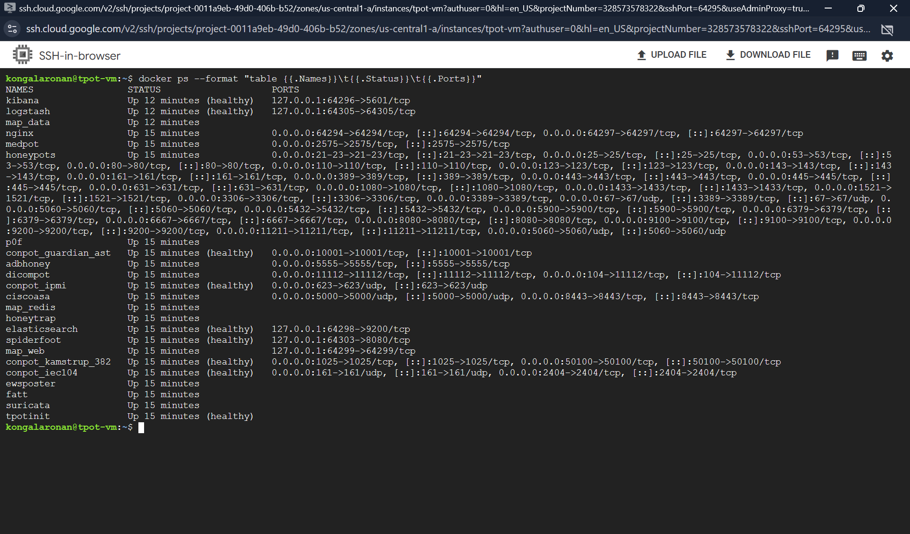

### T-Pot Service Status
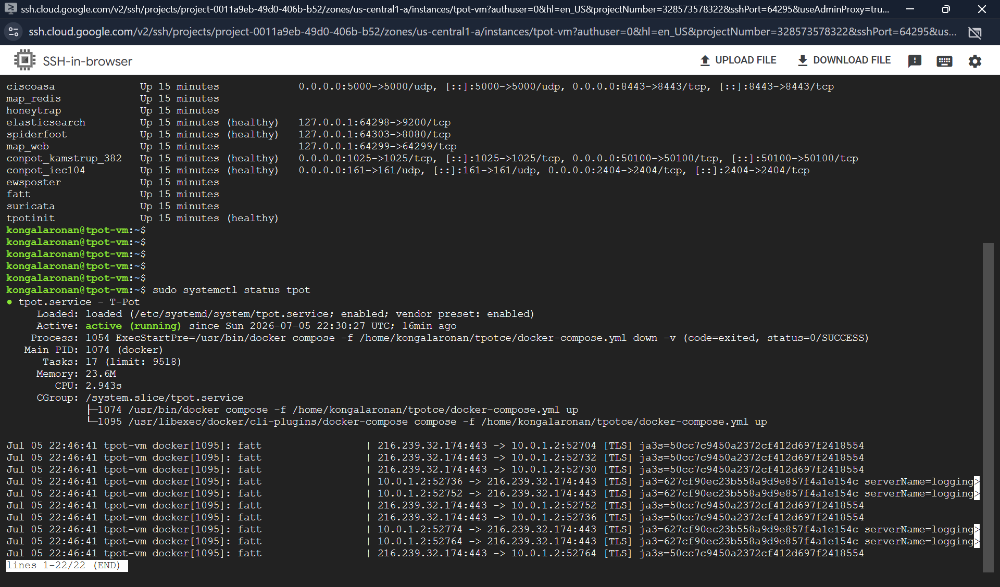

### T-Pot Web Dashboard
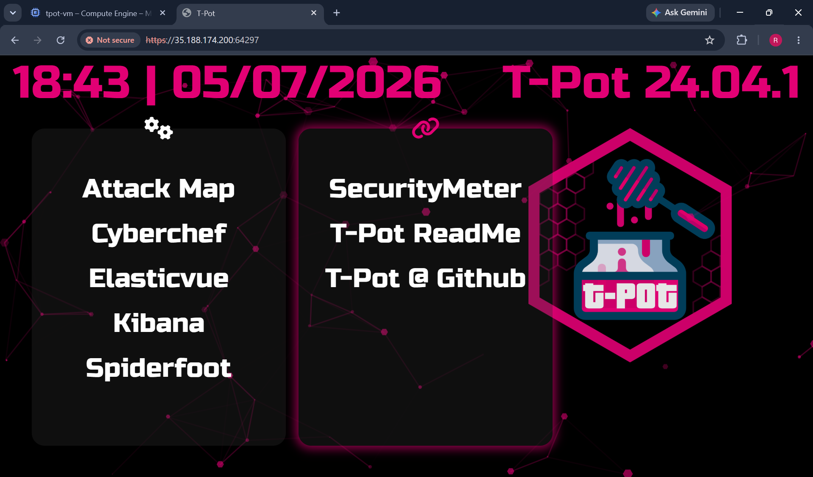

### Live Attack Feed — Vietnam Telnet Scan
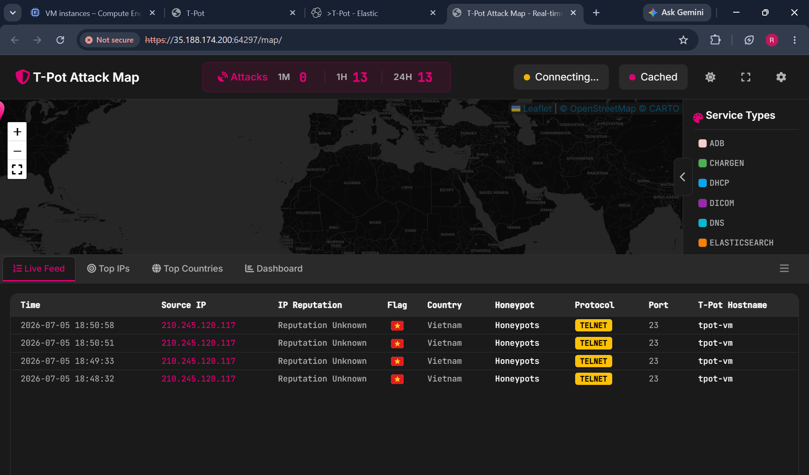

### Kibana Overview Dashboard
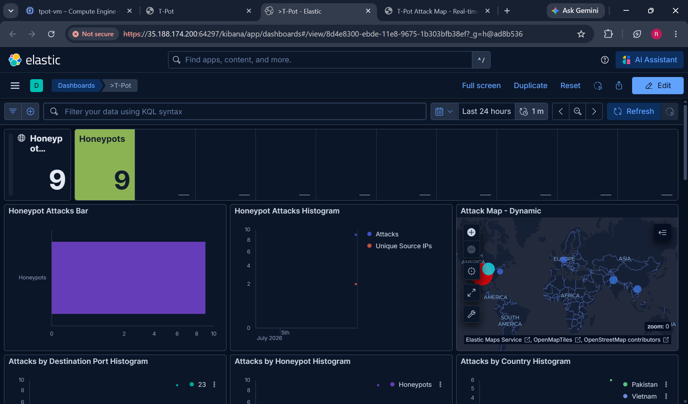

### Kibana — Attack Details (Country + OS Fingerprint)
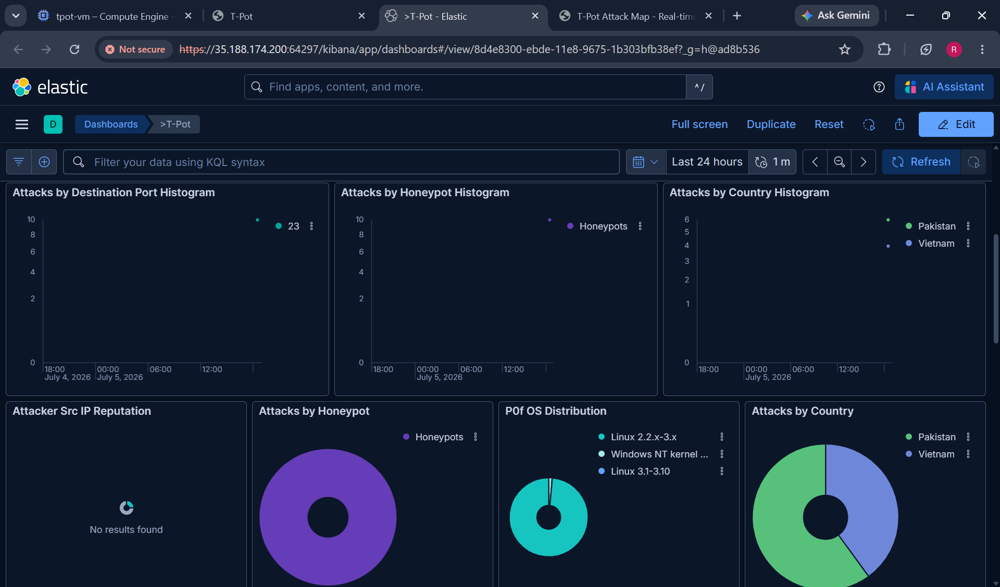

### Suricata IDS Alerts + Top Attacker ASNs
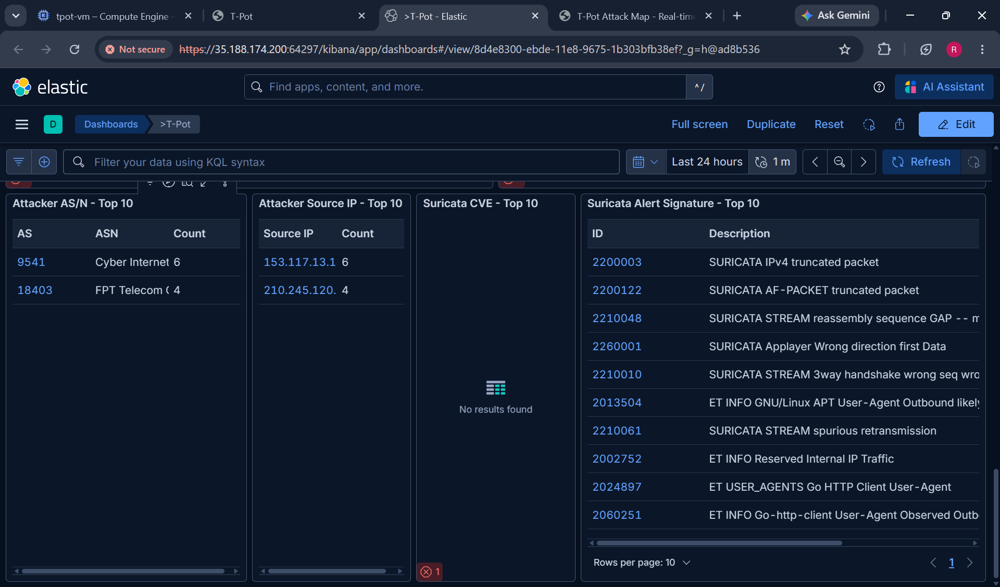

### Splunk Universal Forwarder — Active SSL Connection
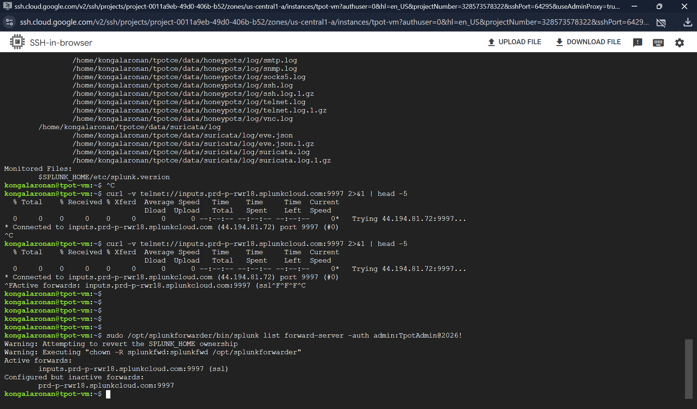

### Nmap Service Version Scan
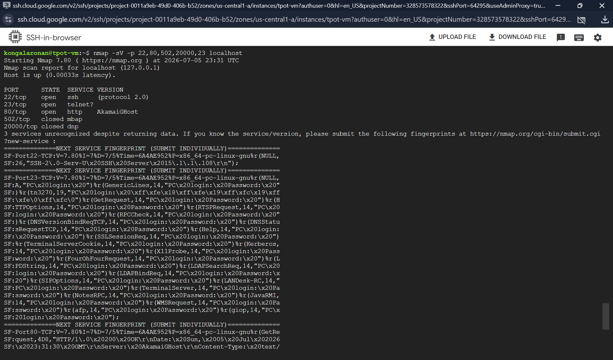

### Splunk Cloud — 66,185 Events Indexed
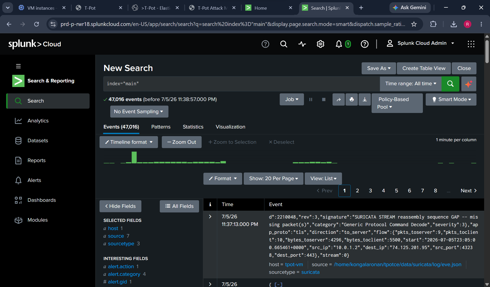

### Splunk — Top Suricata Alert Signatures
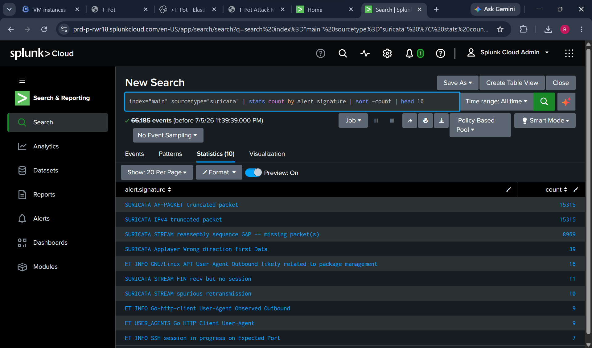

---

## 🔍 Threat Intelligence Findings

### Attack Summary

| Metric | Value |
|---|---|
| Total events captured | 66,185+ |
| Unique attacker countries | Pakistan, Vietnam |
| Top attacker ASN | Cyber Internet Services AS9541 (6 hits) |
| Second ASN | FPT Telecom AS18403 (4 hits) |
| Most targeted port | Port 23 — Telnet |
| Top Suricata signature | AF-PACKET truncated packet (15,315 hits) |
| Attacker OS (P0f) | Linux 2.2.x-3.x, Windows NT kernel |
| Attack pattern | Automated 1-minute interval Telnet scanning |
| Bot indicators | Go HTTP Client, GNU/Linux APT User-Agent |

### Key Observations

The honeypot attracted automated scanners **within minutes** of going live. IP `210.245.120.117` (Vietnam / FPT Telecom) probed Telnet port 23 at precise 1-minute intervals -- a hallmark of botnet credential stuffing against industrial device login prompts.

Suricata flagged 15,315+ AF-PACKET truncated packet events, consistent with high-speed internet-wide scan tools (Masscan/ZMap) performing availability checks before launching targeted attacks.

No Modbus (502) or DNP3 (20000) OT protocol traffic was observed in the first hour, which is expected -- OT-targeted attacks are lower frequency but more sophisticated than generic internet scanning.

---

## 🗺️ MITRE ATT&CK Mapping

| Technique | ID | Observed Evidence |
|---|---|---|
| Active Scanning | T1595 | Automated Telnet/SSH probes at 1-min intervals |
| Network Service Discovery | T1046 | Port scanning across 23, 80, 502, 20000 |
| Valid Accounts | T1078 | Login attempts on Cowrie Telnet honeypot |
| Exploit Public-Facing Application | T1190 | Credential stuffing on emulated ICS devices |

---

## 🔒 Hardening Applied

- Egress traffic blocked via GCP deny-all firewall rule
- SSH restricted to GCP IAP range only (`35.235.240.0/20`)
- T-Pot management UI (port 64297) restricted to analyst IP
- Honeypot subnet isolated from management subnet (`10.0.2.0/24`)
- No default outbound internet route post-setup

---

## 📋 Frameworks Referenced

- **NIST CSF** — Detect (DE.CM-1: Monitor network for events, DE.CM-7: Monitor for unauthorized activity)
- **MITRE ATT&CK for ICS** — Initial Access, Discovery techniques
- **ICS-CERT** threat intelligence practices

---

## 👤 Author

**Ronan Kongala** — MS Cybersecurity, Northeastern University  
Cybersecurity Intern (AI/ML) @ Abbott | [GitHub](https://github.com/ronankongala) | [LinkedIn](https://linkedin.com/in/ronankongala)
