<div align="center">

# 🛡️ Cloud OT Honeypot with SIEM Integration


```
 ██████╗ ████████╗    ██╗  ██╗ ██████╗ ███╗   ██╗███████╗██╗   ██╗██████╗  ██████╗ ████████╗
██╔═══██╗╚══██╔══╝    ██║  ██║██╔═══██╗████╗  ██║██╔════╝╚██╗ ██╔╝██╔══██╗██╔═══██╗╚══██╔══╝
██║   ██║   ██║       ███████║██║   ██║██╔██╗ ██║█████╗   ╚████╔╝ ██████╔╝██║   ██║   ██║   
██║   ██║   ██║       ██╔══██║██║   ██║██║╚██╗██║██╔══╝    ╚██╔╝  ██╔═══╝ ██║   ██║   ██║   
╚██████╔╝   ██║       ██║  ██║╚██████╔╝██║ ╚████║███████╗   ██║   ██║     ╚██████╔╝   ██║   
 ╚═════╝    ╚═╝       ╚═╝  ╚═╝ ╚═════╝ ╚═╝  ╚═══╝╚══════╝   ╚═╝   ╚═╝      ╚═════╝    ╚═╝  
```

**Internet-facing OT honeypot on GCP that logged 66,185 events from live attacker traffic in its first hour**


</div>

---

## Stats From the First Hour

<div align="center">

| Events Captured | Countries | Top Port | Suricata Alerts |
|:---:|:---:|:---:|:---:|
| **66,185** | **Pakistan, Vietnam** | **Port 23 (Telnet)** | **15,315 AF-PACKET** |

</div>

---

## Architecture

```
┌─────────────────────────────────────────────────────────────┐
│                    INTERNET (Attacker Traffic)               │
│            🇵🇰 Pakistan  🇻🇳 Vietnam  🌐 Global Scanners      │
└─────────────────────────┬───────────────────────────────────┘
                          │
                          ▼
┌─────────────────────────────────────────────────────────────┐
│                  GCP VPC (ot-honeypot-vpc)                  │
│                                                             │
│  ┌─ Firewall Rules ────────────────────────────────────┐   │
│  │  ✅ ALLOW  TCP 502   (Modbus)                        │   │
│  │  ✅ ALLOW  TCP 20000 (DNP3)                          │   │
│  │  ✅ ALLOW  TCP 80    (HTTP honeypot)                 │   │
│  │  ✅ ALLOW  TCP 23    (Telnet/Cowrie)                 │   │
│  │  🔒 DENY   All egress                               │   │
│  └─────────────────────────────────────────────────────┘   │
│                                                             │
│  ┌─ honeypot-subnet 10.0.1.0/24 ──────────────────────┐   │
│  │                                                     │   │
│  │  ┌─ tpot-vm (Ubuntu 22.04 / e2-standard-2) ──────┐ │   │
│  │  │                                                │ │   │
│  │  │  🐋 Docker Containers (T-Pot 24.04)            │ │   │
│  │  │  ├── 🏭 Conpot  → Modbus / DNP3 / IEC104      │ │   │
│  │  │  ├── 🐚 Cowrie  → SSH / Telnet                 │ │   │
│  │  │  ├── 🔍 Suricata → IDS / Network Analysis      │ │   │
│  │  │  ├── 📊 ELK Stack → Kibana Dashboard           │ │   │
│  │  │  └── 📡 Splunk UF → Splunk Cloud SIEM          │ │   │
│  │  └────────────────────────────────────────────────┘ │   │
│  └─────────────────────────────────────────────────────┘   │
└─────────────────────────────────────────────────────────────┘
                          │
              ┌───────────┴───────────┐
              ▼                       ▼
    ┌─────────────────┐    ┌──────────────────┐
    │  Kibana / ELK   │    │   Splunk Cloud   │
    │  (built-in)     │    │  66,185+ events  │
    └─────────────────┘    └──────────────────┘
```

---

## Technologies Used

| Category | Tools |
|---|---|
| Cloud Infrastructure | GCP VPC, Compute Engine, Cloud NAT, Firewall Rules |
| Honeypot Frameworks | T-Pot 24.04, Conpot, Cowrie, Medpot, CiscoASA emulator |
| OT Protocols Emulated | Modbus/502, DNP3/20000, IEC104, IPMI, Kamstrup 382 |
| IDS | Suricata with Emerging Threats ruleset |
| SIEM | Splunk Cloud (Universal Forwarder), Kibana/ELK |
| Log Sources | Suricata eve.json, Conpot logs, SSH/Telnet honeypot logs |
| Vulnerability Scanning | Nmap 7.80 (service version detection) |
| Containerization | Docker Compose (20+ containers) |

---

## Deployment

### Phase 1: GCP Network Setup

```bash
# VPC and subnets
gcloud compute networks create ot-honeypot-vpc --subnet-mode=custom
gcloud compute networks subnets create honeypot-subnet \
  --network=ot-honeypot-vpc --region=us-central1 --range=10.0.1.0/24

# Firewall rules
gcloud compute firewall-rules create allow-honeypot-ports \
  --network=ot-honeypot-vpc --allow=tcp:502,tcp:20000,tcp:80,tcp:23 \
  --source-ranges=0.0.0.0/0
```

### Phase 2: T-Pot Installation

```bash
git clone https://github.com/telekom-security/tpotce
cd tpotce
./install.sh -t i -u tpotadmin -p <password>
sudo reboot
```

### Phase 3: Splunk SIEM Integration

```bash
# Install Universal Forwarder
wget -O splunkforwarder.deb "https://download.splunk.com/products/universalforwarder/releases/9.2.1/linux/splunkforwarder-9.2.1-78803f08aabb-linux-2.6-amd64.deb"
sudo dpkg -i splunkforwarder.deb

# Install Splunk Cloud credentials package
sudo /opt/splunkforwarder/bin/splunk install app splunkclouduf.spl

# Monitor T-Pot log sources
sudo /opt/splunkforwarder/bin/splunk add monitor /home/user/tpotce/data/suricata/log -sourcetype suricata
sudo /opt/splunkforwarder/bin/splunk add monitor /home/user/tpotce/data/conpot/log -sourcetype conpot
sudo /opt/splunkforwarder/bin/splunk add monitor /home/user/tpotce/data/honeypots/log -sourcetype honeypots
```

### Phase 4: Vulnerability Scan

```bash
nmap -sV -p 22,80,502,20000,23 <honeypot-external-ip>
```

---

## Screenshots

| | |
|:---:|:---:|
| 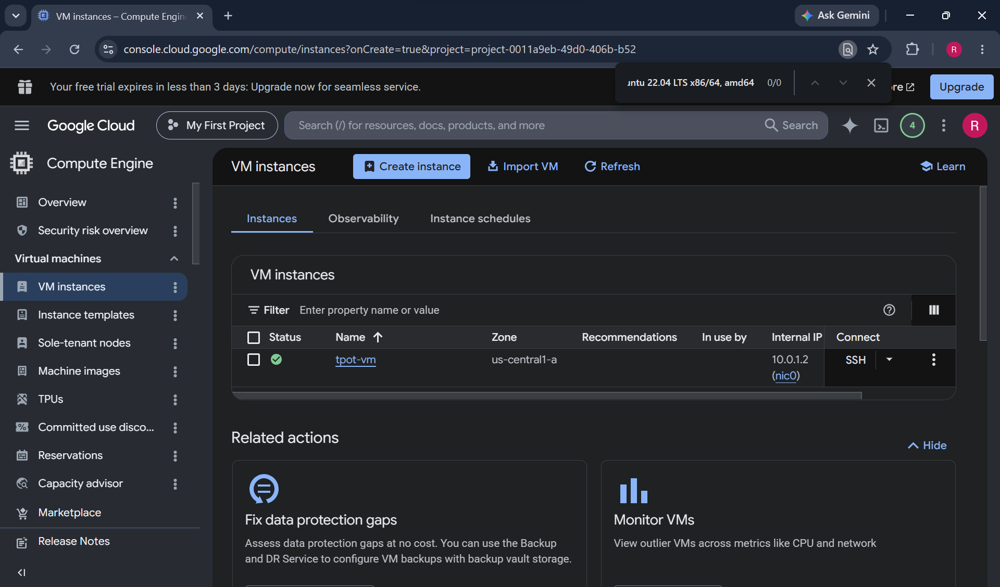<br>GCP VM running | 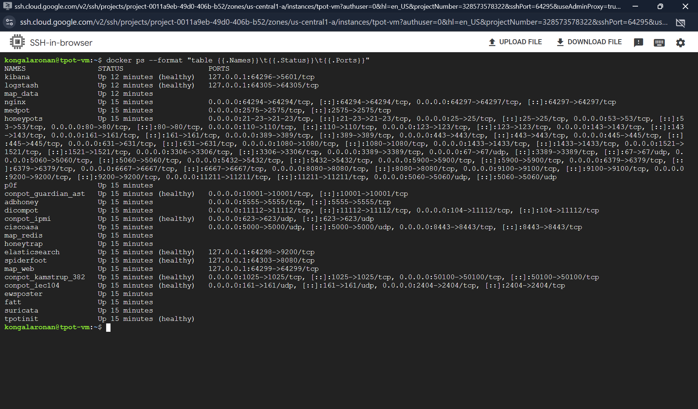<br>T-Pot Docker containers (20+ services) |
| 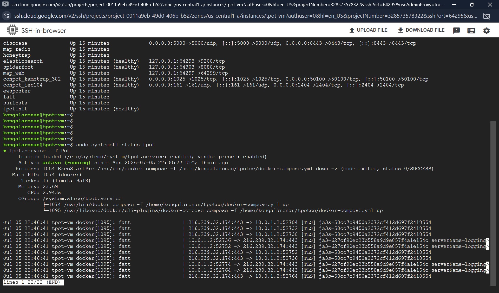<br>T-Pot service status | 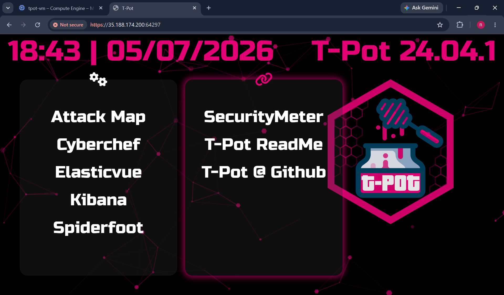<br>T-Pot web dashboard |
| 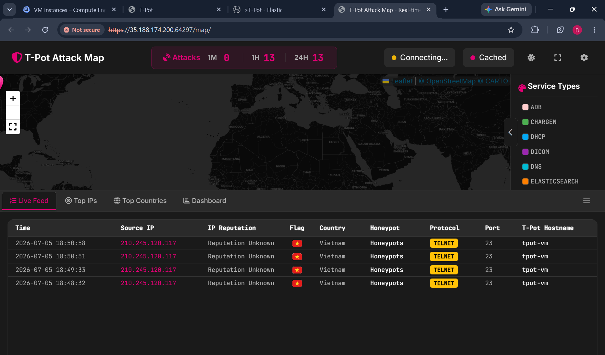<br>Live attack feed: Vietnam Telnet scan | 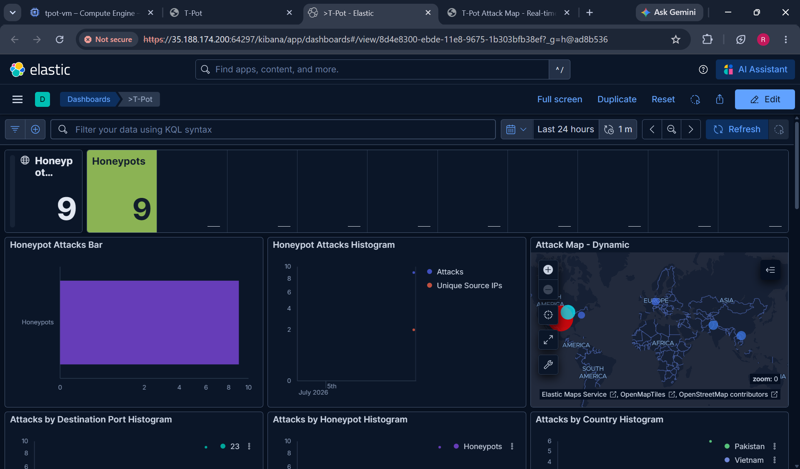<br>Kibana overview dashboard |
| 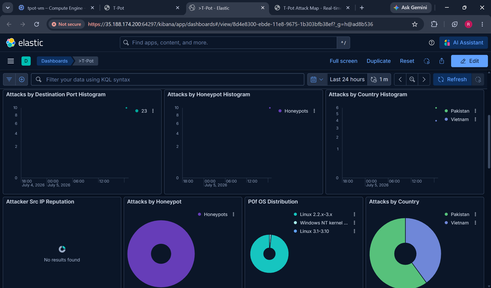<br>Kibana attack details (country and OS fingerprint) | 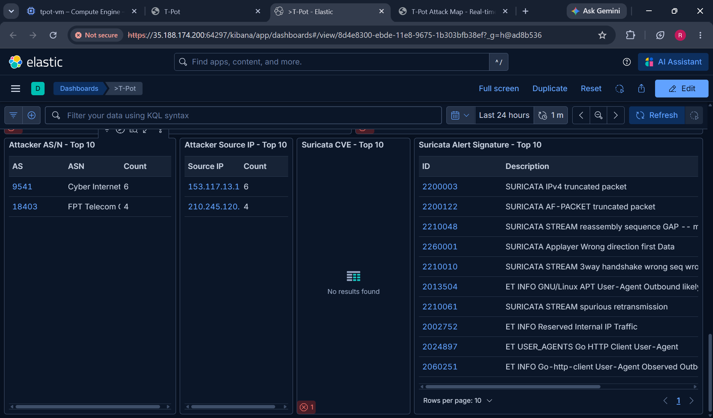<br>Suricata IDS alerts and top attacker ASNs |
| 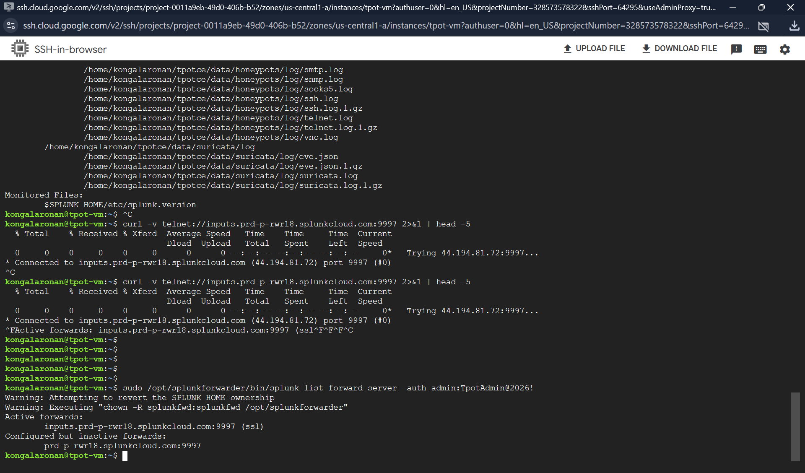<br>Splunk Universal Forwarder with an active SSL connection | 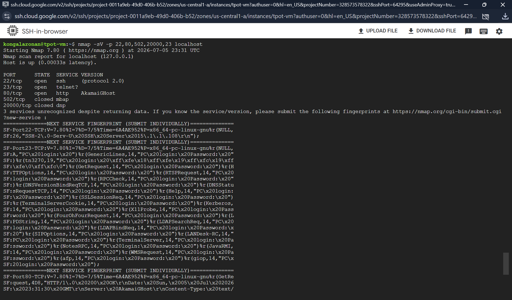<br>Nmap service version scan |
| 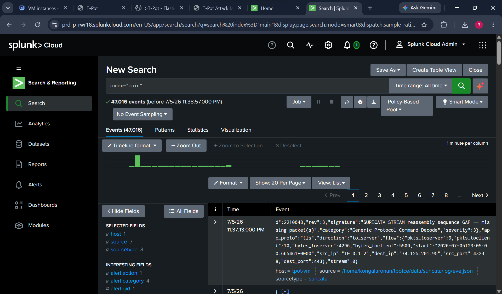<br>Splunk Cloud events arriving in the main index | 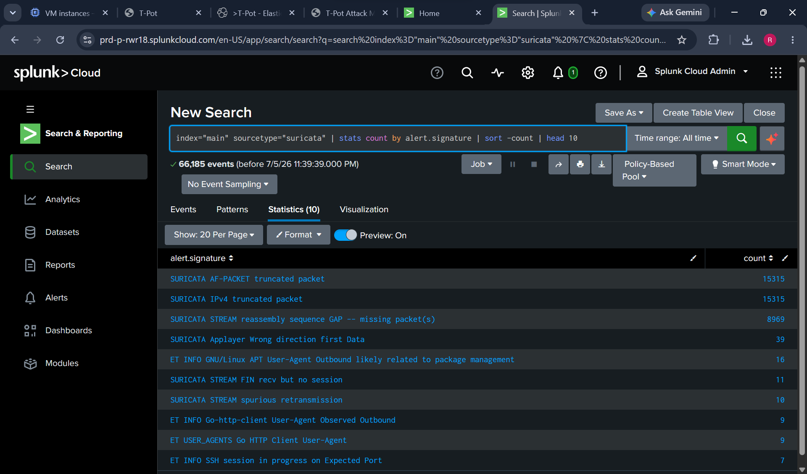<br>Top Suricata alert signatures across 66,185 events |

---

## Threat Intelligence Findings

### Attack Summary

| Metric | Value |
|---|---|
| Total events captured | 66,185 |
| Unique attacker countries | Pakistan, Vietnam |
| Top attacker ASN | Cyber Internet Services AS9541 (6 hits) |
| Second ASN | FPT Telecom AS18403 (4 hits) |
| Most targeted port | Port 23 (Telnet) |
| Top Suricata signature | AF-PACKET truncated packet (15,315 hits) |
| Attacker OS (P0f) | Linux 2.2.x-3.x, Windows NT kernel |
| Attack pattern | Automated 1-minute interval Telnet scanning |
| Bot indicators | Go HTTP Client, GNU/Linux APT User-Agent |

### Key Observations

Automated scanners found the honeypot within minutes of it going live. IP `210.245.120.117` (Vietnam, FPT Telecom) probed Telnet port 23 at exact 1-minute intervals, the pattern of a botnet trying credentials against industrial device login prompts.

Suricata logged 15,315 AF-PACKET truncated packet events. High-speed internet-wide scanners such as Masscan or ZMap, checking which hosts are up before a targeted attack, are the likely source.

No Modbus (502) or DNP3 (20000) traffic showed up in the first hour. Attacks aimed at OT protocols are much rarer than generic internet scanning, so an hour is too short a window to expect them.

---

## MITRE ATT&CK Mapping

| Technique | ID | Observed Evidence |
|---|---|---|
| Active Scanning | T1595 | Automated Telnet/SSH probes at 1-min intervals |
| Network Service Discovery | T1046 | Port scanning across 23, 80, 502, 20000 |
| Valid Accounts | T1078 | Login attempts on Cowrie Telnet honeypot |
| Exploit Public-Facing Application | T1190 | Credential stuffing on emulated ICS devices |

---

## Hardening Applied

- Egress traffic blocked via GCP deny-all firewall rule
- SSH restricted to GCP IAP range only (`35.235.240.0/20`)
- T-Pot management UI (port 64297) restricted to analyst IP
- Honeypot subnet isolated from management subnet (`10.0.2.0/24`)
- No default outbound internet route post-setup

---

## Frameworks Referenced

- **NIST CSF** Detect: DE.CM-1 (monitor the network for events) and DE.CM-7 (monitor for unauthorized activity)
- **MITRE ATT&CK for ICS**: Initial Access and Discovery techniques

---

## Author

**Ronan Kongala**, MS Cybersecurity, Northeastern University  
Cybersecurity Intern (AI/ML) @ Abbott | [GitHub](https://github.com/ronankongala) | [LinkedIn](https://linkedin.com/in/ronankongala)
